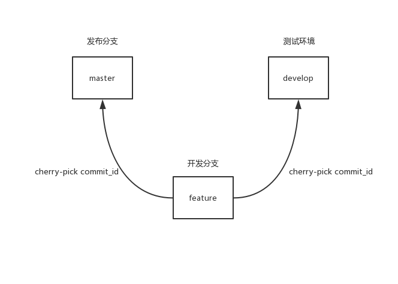

# mmp-cli
git 工作流快捷工具

> Node v10.8.0

## 安装
```shell
npm install mmp-cli -D
```

## 介绍



针对的工作流场景如下

- 开发分支是从master上拉取的，后续所有在开发分支上的改动，都以cherry-pick的形式到master或develop

- 开发分支不做打包，打包都在master或develop上进行，开发的commit和打包的commit需要分开，以便减少`revert`时的冲突

- 开发分支不push到远程，提交的message需要区分打包和正常的修改提交，且备注分支名称，便于后期查找

## 使用

#### mmp ci [branch]

提交当前分支到master或develop，`branch`可选，不填默认为当前分支。提交完成后再根据用户选择是否需要打包继续执行，打包后再提交，将2次提交一起推送到仓库。

#### mmp cp [commit_id] [branch]

cherry-pick 某个提交到master或develop，参数必填。cherry-pick完成后，会根据用户选择是否需要打包继续完成上述流程。

#### mmp init

初始化master或develop打包命令，由于无法检测命令的有效性，所以目前只是同步package.json中的scripts命令。

#### mmp build

打包当前分支并提交

## 待完成

- [ ] 将主分支作为可配项，默认为master和develop
- [ ] 校验当前命令是否在项目根目录下执行


